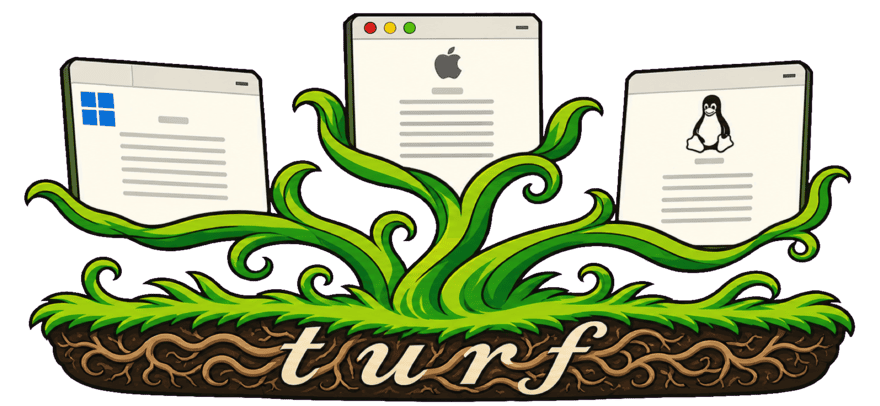

<!-- SPDX-License-Identifier: MPL-2.0 -->
<!-- Copyright (c) 2025-2026 awesomo4000 -->

<p align="left">
  
</p>

# turf

Lightweight webviews with message passing between native code (Zig) and JavaScript. Turf creates native windows with platform webviews for building portable desktop applications using web technologies.

## Features

- Native window management with platform webview integration
- Bidirectional JSON message passing between JavaScript and Zig
- URL, local file, and HTML content loading
- JavaScript evaluation from native code
- Persistent zoom controls and standard application quit behavior on macOS

## Supported OSes

| Operating system | Native window layer | Web technology | Requirements |
| --- | --- | --- | --- |
| macOS | Cocoa | WebKit (`WKWebView`) | Xcode Command Line Tools |
| Linux | GTK4 | WebKitGTK 6.0 and JavaScriptCoreGTK 6.0 | GTK4 and WebKitGTK development packages |
| Windows | Win32 | Microsoft Edge WebView2 | WebView2 Runtime |

### Prerequisites

- Zig 0.16.0
- The platform requirements listed above

### Building

```bash
# Build the project
zig build

# Run the application
zig build run

# Run the messaging demo
zig build run-demo

# Run tests
zig build test
```

### Usage

```bash
# Launch with default page
./zig-out/bin/turf

# Open a URL
./zig-out/bin/turf https://example.com

# Open a local file
./zig-out/bin/turf path/to/file.html
```

## Keyboard Shortcuts

These shortcuts are currently available on macOS:

| Shortcut | Action |
| --- | --- |
| <kbd>Cmd</kbd> + <kbd>+</kbd> | Zoom in |
| <kbd>Cmd</kbd> + <kbd>-</kbd> | Zoom out |
| <kbd>Cmd</kbd> + <kbd>0</kbd> | Reset zoom |
| <kbd>Cmd</kbd> + <kbd>Q</kbd> | Quit |

## Architecture

Turf uses a layered architecture:

- **Native layer** (Zig): Window management and application lifecycle
- **Bridge layer**: Platform-specific Cocoa/WebKit, GTK4/WebKitGTK, or Win32/WebView2 integration
- **Web layer** (JavaScript/HTML): User interface and application logic

Communication between the native and web layers uses JSON message passing.

## Development

See [DEVELOP.md](DEVELOP.md) for detailed development guidelines and architecture documentation.

## License

Copyright (c) 2025-2026 awesomo4000. Original Turf code is licensed under the
[Mozilla Public License 2.0](LICENSE).
When MPL-covered Turf files are distributed with modifications, those files and
their modifications must remain available under MPL-2.0. Separate applications
and source files that merely import, link to, or use Turf may remain proprietary
or use another license.

Microsoft WebView2 loader binaries retain their upstream terms and are not
covered by Turf's MPL-2.0 license. See
[THIRD_PARTY_NOTICES.md](THIRD_PARTY_NOTICES.md) for details.
